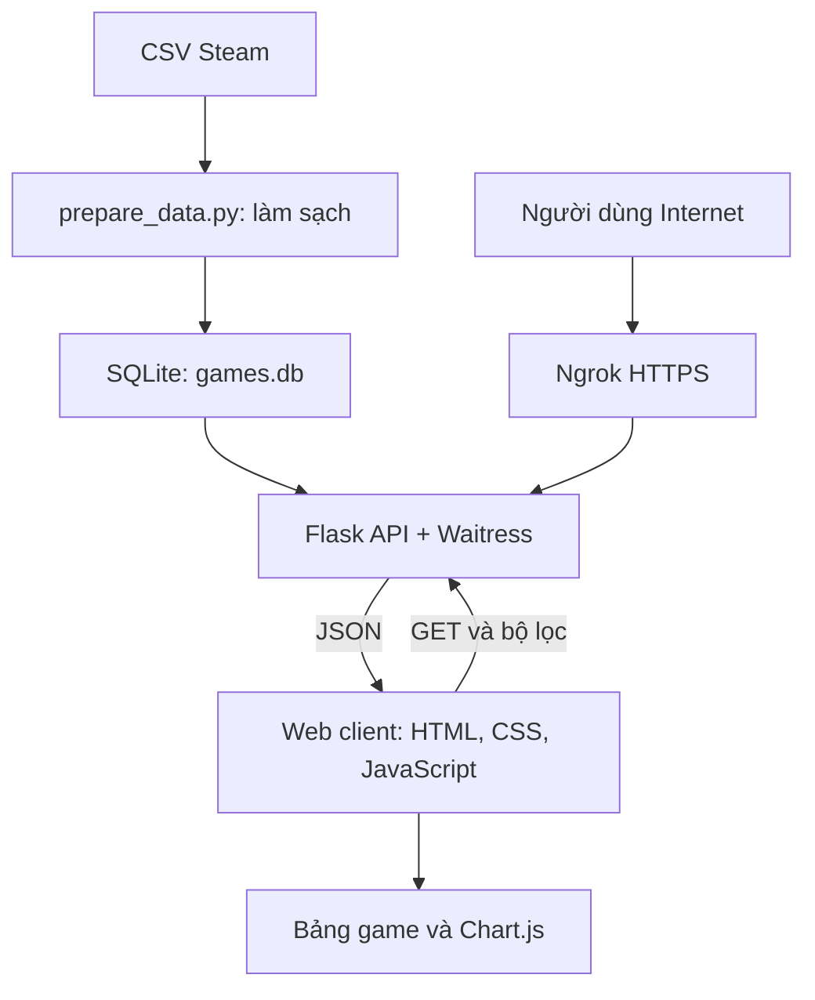

# Steam Atlas
## Xây dựng ứng dụng web tra cứu và trực quan hóa dữ liệu trò chơi trên Steam sử dụng Flask API

### Thông tin thực hiện

- Họ và tên: Vũ Trung Kỳ
- Repository: https://github.com/Kyzu30/steam-dashboard
- Website: [Điền link Ngrok]

## 1. Tổng quan sản phẩm

Steam Atlas là ứng dụng web giúp người dùng tra cứu và khám phá dữ liệu trò chơi trên Steam. Người dùng có thể tìm kiếm theo tên, lọc theo thể loại, khoảng giá, năm phát hành và hình thức miễn phí hoặc trả phí.

Ứng dụng hiển thị các chỉ số tổng hợp, bảng danh sách game và ba biểu đồ. Dữ liệu được cung cấp bởi Flask API và lưu trữ trong SQLite.

### Chức năng chính

- Tìm kiếm game theo tên.
- Lọc theo thể loại, giá, năm phát hành và hình thức miễn phí/trả phí.
- Hiển thị tổng số game phù hợp, giá trung bình và số game miễn phí.
- Sắp xếp danh sách theo tên, giá hoặc năm phát hành.
- Phân trang danh sách game.
- Hiển thị ba biểu đồ trực quan.
- Nhấn chú thích biểu đồ để ẩn hoặc hiện dữ liệu.
- Tải biểu đồ dưới dạng ảnh PNG.
- Hiển thị trạng thái đang tải, lỗi và không có kết quả phù hợp.

## 2. Tổng quan dữ liệu

### 2.1. Nguồn dữ liệu

- Dataset: Steam Games Dataset.
- Tác giả cung cấp: FronkonGames.
- Nền tảng: Kaggle.
- Đường dẫn: https://www.kaggle.com/datasets/fronkongames/steam-games-dataset
- Định dạng sử dụng: CSV.
- Ngày tải dữ liệu: 13/09/2026
- Số dòng trước xử lý: 125855
- Số dòng sau xử lý: 125854

### 2.2. Các trường được sử dụng

| Trường CSV | Ý nghĩa | Mục đích sử dụng |
|---|---|---|
| AppID | Mã định danh game | Khóa chính, phát hiện trùng |
| Name | Tên game | Hiển thị và tìm kiếm |
| Release date | Ngày phát hành | Chuẩn hóa và tách năm |
| Price | Giá game | Lọc và thống kê giá |
| Genres | Thể loại | Lọc và thống kê thể loại |
| Positive | Số đánh giá tích cực | Lưu trong database và trả qua API |
| Negative | Số đánh giá tiêu cực | Lưu trong database và trả qua API |

Giao diện hiển thị giá theo USD. Giá trong dataset không bảo đảm trùng với giá hiện tại hoặc giá tại từng khu vực.

### 2.3. Vấn đề dữ liệu và cách xử lý

Quá trình xử lý được thực hiện trong `prepare_data.py`:

- Kiểm tra sự tồn tại của các cột bắt buộc.
- Tách tiêu đề `DiscountDLC count` thành hai cột `Discount` và `DLC count` trong bản CSV sử dụng.
- Kiểm tra số lượng giá trị của mỗi bản ghi sau khi sửa tiêu đề.
- Loại bản ghi thiếu mã game, mã không hợp lệ hoặc thiếu tên game.
- Loại mã game trùng; giữ bản ghi hợp lệ xuất hiện đầu tiên.
- Chuyển giá sang kiểu số; giá thiếu hoặc không hợp lệ được lưu là NULL.
- Không chuyển giá thiếu thành 0 vì giá 0 được hiểu là miễn phí.
- Chuẩn hóa ngày phát hành và tách năm; ngày không đọc được được lưu là NULL.
- Tách các thể loại và loại thể loại trùng trong cùng một game.
- Lưu dữ liệu đã xử lý vào SQLite.

Kết quả xử lý được ghi trong `data/cleaning_report.json`, gồm số dòng đầu vào, đầu ra, số bản ghi bị loại và số trường dữ liệu chưa rõ.

### 2.4. Giới hạn khi diễn giải

- Một game có thể thuộc nhiều thể loại, nên tổng lượt game theo thể loại có thể lớn hơn tổng số game.
- Biểu đồ thể loại chỉ hiển thị 10 thể loại có nhiều game nhất trong kết quả lọc.
- Giá trung bình bao gồm game miễn phí và bỏ qua giá NULL.
- Biểu đồ theo năm không tính game chưa xác định được năm phát hành.
- Số lượng game phản ánh dataset sử dụng, không phải số liệu doanh thu hoặc số người chơi.

## 3. Kiến trúc sản phẩm



### 3.1. Các thành phần phía server

| Thành phần | Nhiệm vụ |
|---|---|
| prepare_data.py | Đọc CSV, xử lý dữ liệu, tạo SQLite và báo cáo |
| app.py | Khai báo API, kiểm tra tham số, truy vấn database và trả kết quả |
| SQLite | Lưu thông tin game, quan hệ game–thể loại và metadata |
| Flask-CORS | Cấu hình CORS cho API |
| Waitress | Phục vụ ứng dụng Flask tại cổng 5000 |

Database gồm ba bảng:

- `games`: thông tin của từng game.
- `game_genres`: liên kết game với các thể loại.
- `metadata`: thông tin nguồn và kết quả nhập dữ liệu.

### 3.2. Web client

- HTML: xây dựng cấu trúc giao diện.
- CSS: định dạng giao diện theo bảng màu xanh đậm và xanh cyan.
- JavaScript: xử lý tương tác và gọi API bằng `fetch()`.
- Chart.js: dựng biểu đồ từ dữ liệu API.

Flask phục vụ trang HTML tại `/` và các tài nguyên tại `/static/`. JavaScript sử dụng đường dẫn API tương đối nên hoạt động trên cả localhost và Ngrok.

## 4. Thiết kế 3 API

### 4.1. GET /api/filters

**Chức năng:** lấy danh sách thể loại, giới hạn năm/giá và thông tin nguồn dữ liệu.

Kết quả gồm:

- `genres`: danh sách thể loại.
- `bounds`: giới hạn năm và giá.
- `metadata`: thông tin lần nhập dữ liệu.

Client sử dụng API này để khởi tạo các lựa chọn thể loại.

### 4.2. GET /api/games

**Chức năng:** lấy danh sách game theo bộ lọc, có sắp xếp và phân trang.

| Tham số | Ý nghĩa |
|---|---|
| search | Tìm theo tên game |
| genre | Lọc thể loại |
| min_price, max_price | Khoảng giá |
| year_from, year_to | Khoảng năm phát hành |
| price_type | free, paid hoặc unknown |
| sort | name, newest hoặc price_asc |
| page | Trang hiện tại, mặc định 1 |
| page_size | Số game mỗi trang, mặc định 12, tối đa 100 |
| format | json hoặc csv |

Ví dụ:

```text
/api/games?genre=Action&max_price=20&page=1&page_size=12
```

JSON trả về gồm `items`, `total`, `page`, `page_size` và `pages`.

API vẫn hỗ trợ `format=csv` để xuất toàn bộ kết quả lọc; nút xuất CSV đã được ẩn trên giao diện.

### 4.3. GET /api/stats

**Chức năng:** trả các chỉ số và dữ liệu cho ba biểu đồ.

Ví dụ:

```text
/api/stats?genre=Action&max_price=20
```

Kết quả gồm:

- `summary`: tổng game, giá trung bình, số game miễn phí/trả phí và số trường chưa rõ.
- `genres`: số lượt game theo thể loại.
- `years`: số game theo năm phát hành.
- `pricing`: số game miễn phí, trả phí và chưa rõ giá.

API thống kê và API danh sách sử dụng chung bộ lọc. Thống kê tính trên toàn bộ kết quả phù hợp, không chỉ trang danh sách đang hiển thị.

### 4.4. Xử lý lỗi

| Mã HTTP | Ý nghĩa |
|---|---|
| 200 | Xử lý thành công, bao gồm trường hợp không có kết quả |
| 400 | Tham số không hợp lệ |
| 503 | Chưa có database hoặc database gặp lỗi |

Ví dụ tham số không hợp lệ: giá âm, trang bằng 0, năm bắt đầu lớn hơn năm kết thúc.

Lỗi được trả dưới dạng JSON có trường `error`.

## 5. Trực quan hóa dữ liệu

| Biểu đồ | Nội dung | Đơn vị |
|---|---|---|
| Biểu đồ cột | Top 10 thể loại có nhiều game | Lượt game |
| Biểu đồ đường | Số game phát hành theo năm | Game |
| Biểu đồ doughnut | Cơ cấu miễn phí, trả phí, chưa rõ giá | Game |

Biểu đồ có chú thích, tooltip và hỗ trợ ẩn/hiện dữ liệu. Các biểu đồ cập nhật sau khi người dùng áp dụng bộ lọc.

## 6. Cấu trúc thư mục

- `app.py`
- `prepare_data.py`
- `requirements.txt`
- `README.md`
- `.gitignore`
- `static/`
  - `index.html`
  - `style.css`
  - `script.js`
- `data/`
  - `raw/games.csv`: tự tải từ nguồn
  - `games.db`: sinh sau khi nhập dữ liệu
  - `cleaning_report.json`: sinh sau khi nhập dữ liệu
- `screenshots/`
  - `dashboard.png`
  - `filtered.png`

CSV gốc, database và môi trường ảo không đưa lên GitHub. Người tải repository có thể tạo lại database theo hướng dẫn bên dưới.

## 7. Công nghệ và thư viện

| Công nghệ/thư viện | Phiên bản | Vai trò |
|---|---|---|
| Python | 3.9.13 | Ngôn ngữ phía server |
| Flask | 3.1.2 | Xây dựng API |
| flask-cors | 6.0.1 | Cấu hình CORS |
| waitress | 3.0.2 | Chạy ứng dụng Flask |
| Chart.js | 4.4.8 | Vẽ biểu đồ |
| Git |  2.55.0.windows.5 | Quản lý phiên bản |
| Ngrok | 3.39.9 | Chia sẻ website qua HTTPS |

Các thư viện chuẩn như `csv`, `sqlite3`, `json`, `pathlib`, `datetime`, `hashlib`, `argparse`, `math` và `io` đi kèm Python, không cần cài riêng.

Danh sách đầy đủ phiên bản các Python package đã cài được ghi trong `requirements.txt`. Chart.js được ghim phiên bản trong `static/index.html` và tải qua CDN.

## 8. Hướng dẫn chạy từ repository

Các lệnh dưới sử dụng PowerShell trên Windows. Mở terminal tại thư mục repository có `app.py`.

### Bước 1: Tải code

Clone repository hoặc tải ZIP từ GitHub rồi giải nén. Mở thư mục có `app.py` bằng VS Code.

### Bước 2: Tạo môi trường và cài thư viện

```powershell
py -m venv .venv
.\.venv\Scripts\python.exe -m pip install -r requirements.txt
```

Trong VS Code, chọn Python interpreter tại `.venv\Scripts\python.exe`.

### Bước 3: Chuẩn bị dữ liệu

Tải CSV từ trang Kaggle đã nêu, giải nén và đặt file tại:

```text
data/raw/games.csv
```

Đây phải là file CSV thật, không phải thư mục mang tên games.csv.

### Bước 4: Nhập dữ liệu

```powershell
.\.venv\Scripts\python.exe prepare_data.py --input data/raw/games.csv
```

Đợi chương trình hoàn tất và xuất báo cáo xử lý.

### Bước 5: Chạy server

```powershell
.\.venv\Scripts\python.exe app.py
```

Mở trình duyệt tại:

```text
http://127.0.0.1:5000
```

Flask đã phục vụ file HTML, không cần mở index.html trực tiếp hoặc sử dụng Live Server.

## 9. Hướng dẫn sử dụng

1. Nhập tên game hoặc chọn các điều kiện lọc.
2. Nhấn “Áp dụng bộ lọc”.
3. Xem các chỉ số, biểu đồ và danh sách kết quả.
4. Chọn cách sắp xếp theo tên, giá hoặc năm.
5. Nhấn “Trước” hoặc “Sau” để chuyển trang.
6. Nhấn chú thích biểu đồ để ẩn/hiện dữ liệu.
7. Nhấn “PNG” để tải ảnh biểu đồ.
8. Nhấn “Đặt lại” để xóa bộ lọc.

## 10. Triển khai qua Ngrok

Cài Ngrok, đăng nhập tài khoản và cấu hình authtoken trên máy cá nhân:

```powershell
ngrok config add-authtoken TOKEN_THAT_CUA_BAN
```

Thay chuỗi mẫu bằng token thật. Không lưu token trong repository.

Giữ server chạy ở terminal thứ nhất. Mở terminal thứ hai:

```powershell
ngrok http 5000
```

Sao chép địa chỉ HTTPS tại dòng Forwarding để truy cập và chia sẻ.

Khi tắt máy, dừng server hoặc dừng Ngrok, website sẽ không còn phục vụ qua đường hầm đó.


